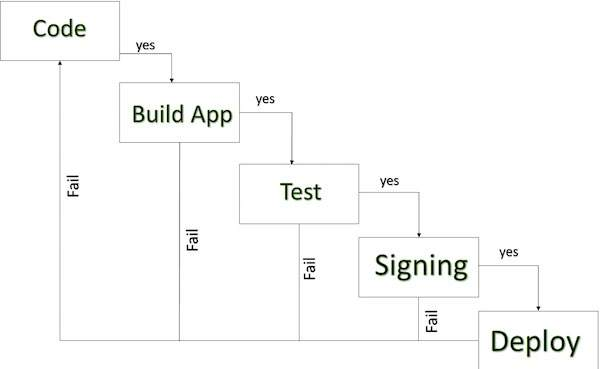
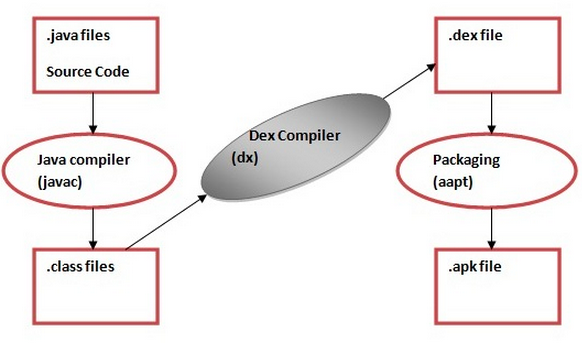

# Android Memo

### Android Development Process

### Java to APK Process Process

#### Points to remember - 

- **AIDL**  - Android Interface Defination Language works between Native code (like .c, .cpp) and Source code (.java).  
- **.dex** - Dalvik Executable file.   
- **.AAPT** - Android Assets Packaging Tool kit, that helps to create .apk.  
- **.apk** - Just a packaged single file (like a zip) including .dex, .xml and some other resources.  
- **JVM** - Java Virtual Machine, to run .class file in java.  
- **DVM or ART since android 5.0-lollipop** - Dalvik Virtual Machine or Android Run Time, to run .dex files packaged under single .apk file (Note: .dex file can't run by JVM).   
- **.JIT** - Just In Time used by DVM, It interpret to native code during run time.      
- **.AOT** - Ahead Of Time used by ART, It compile to native code once at app installation time and keep in single ".oat" file for execution.   

### Options to Identify an android device

- **IMEI** - International Mobile Equipment Identity, Its a telephony module (sim slot) based, never update until sim slot (h/w) change from device.   
- **Android ID** - Generates by android OS on first time boot, Can be change by Factory reset and by Rooted device.   
- **MAC Address of WiFi** - Its WiFi Module based, never update until wifi (h/w) change from device but need wifi enable to get.   
- **MAC Address of Bluetooth** - Its Bluetooth Module based, never update until bluetooth (h/w) change from device but need bluetooth enable to get.   

### Something about gradle dependencies
 
 - gradle file supports DSL (Domain Specific Language) and Java.  
 - eg - &nbsp;&nbsp;&nbsp;&nbsp;&nbsp;&nbsp;&nbsp;&nbsp;&nbsp;&nbsp;junit : junit : 4.12   
 contains - Group id : Artifact id : Version   
 - Mostly gradle dependencies uploaded on Maven Repository Centers "jCenter" and "mavenCentral".  
 - jCenter - Hosted on bintray.com (default by android studio).  
 - mavenCentral - Hosted on sonatype.org.
 
 ### Something about gradle Fragment
 
 #### &nbsp;&nbsp;&nbsp;&nbsp;Why we should use?
 - **Reusability** - One Fragment can use by multiple Activities.  
 - **Flexibility** - One Activity can use by multiple Fragments.  
 - **Dynamically Handling** - Add/Rplace/Remove dynamically while Activity is running.
 
 #### &nbsp;&nbsp;&nbsp;&nbsp;Lifecycle
 
1. onAttach()
2. onCreate() ***--> Can restore data***
3. onCreateView()
4. onViewCrated()
5. onActivityCreated() ***--> Can restore data***
6. onStart()
7. onResume() ---> ideal condition   
   - On replace/add next Fragment these 7 methods would be repeat for next Fragment. 
   - And this below 2 methods would be call on this Fragment.    
8. onPause()    
9. onStop()   
   - If remove this Fragment below 2 methods would be call on this Fragment.   
10. onDestroyView()   
    ***onSaveInstanceState() --> Can call any time before onDestroy.***
11. onDestroy()   
12. onDetach()   
   